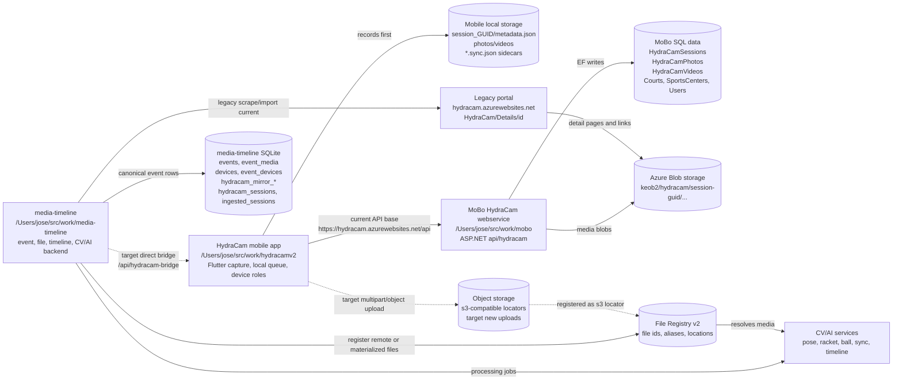
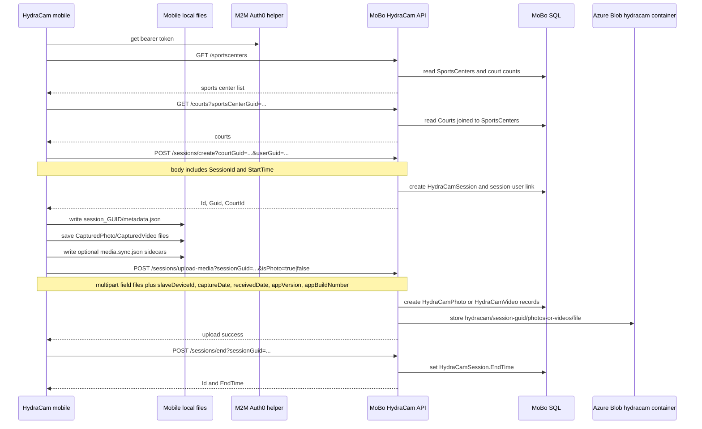
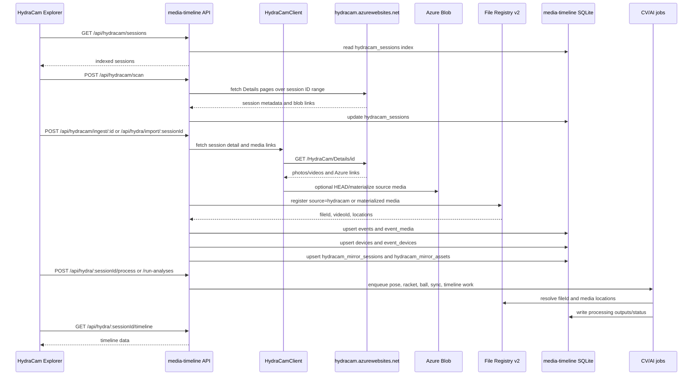
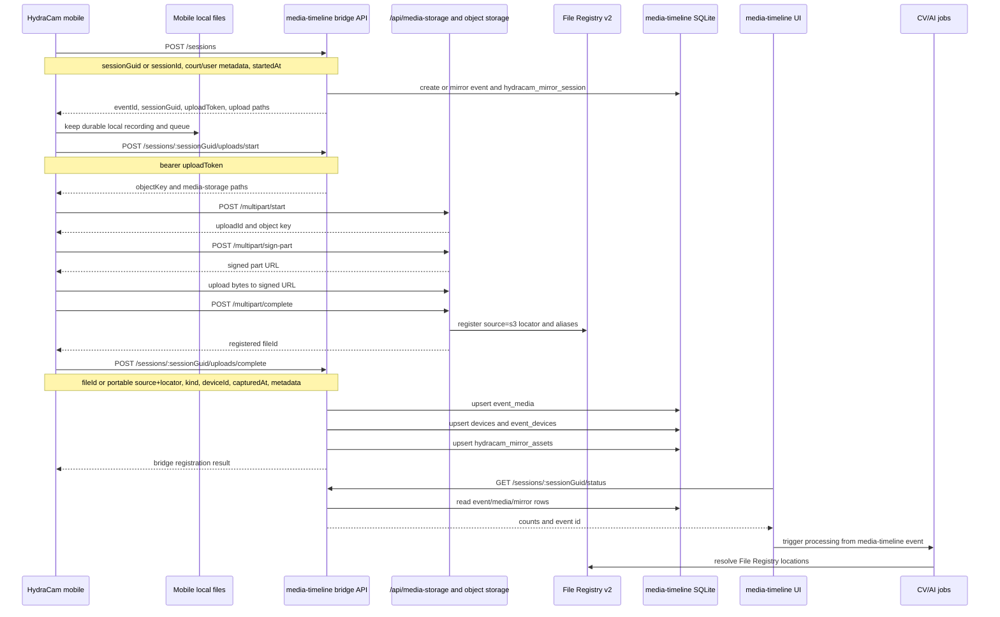
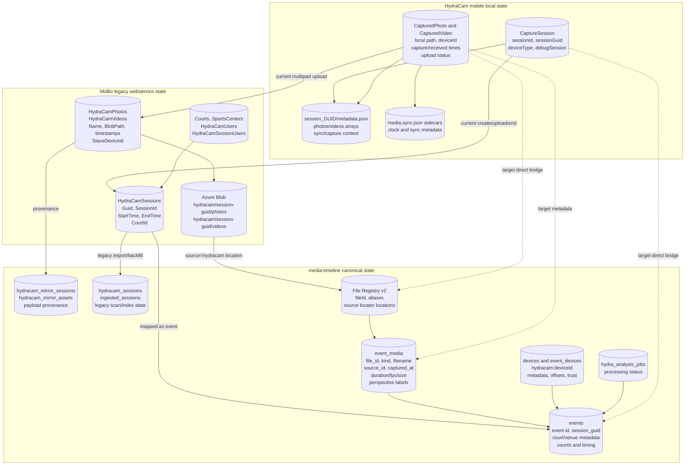

# Cross-Project API And Data Map

Last reviewed: 2026-06-12.

This document visualizes how HydraCam mobile, the MoBo HydraCam webservice, and
media-timeline relate at the API, endpoint, storage, and ownership layers.
For the user-flow and cross-system finite-state-machine view, see
`user-flow-fsm-diagrams.md`.

Legend:

- `current`: implemented/currently used path.
- `in progress`: code exists but is not fully cut over or verified end to end.
- `target`: intended direction from the merge plan.
- `legacy`: retained for historical data and compatibility.

## System Context

## Current Mobile To MoBo API Flow

This is the live mobile path today. The Flutter app records locally first, then
uses the legacy API base `https://hydracam.azurewebsites.net/api`.

### Current Mobile Endpoint Calls

| Mobile method | Current endpoint path | Purpose | Data sent |
| --- | --- | --- | --- |
| `fetchSportsCenters()` | `GET /sportscenters` | Venue discovery | bearer token |
| `fetchCourts()` | `GET /courts?sportsCenterGuid=...` | Court discovery | sports-center GUID |
| `fetchSessions()` | `GET /sessions?courtGuid=...` | Legacy session list for a court | court GUID |
| `createSession()` | `POST /sessions/create?courtGuid=...&userGuid=...` | Create backend session | `SessionId`, `StartTime` |
| `uploadMedia()` | `POST /sessions/upload-media?sessionGuid=...&isPhoto=...` | Upload photo or video | multipart `files`, device ID, capture/received timestamps, app version/build |
| `endSession()` | `POST /sessions/end?sessionGuid=...` | End backend session | session GUID |
| `notifyReadyToTransmit()` | `POST /device/ReadyToTransmit` | Legacy streaming readiness marker | `DeviceId`, `SessionGuid` |

Note: the mobile source also has a user lookup contract for
`users/get-by-email`; the inspected MoBo controller exposes `GetUserByEmail`.
Treat this as a route-alias/deployed-contract item to verify before cutover.

## Existing media-timeline Legacy Import Flow

This is the existing backfill and processing path. It imports MoBo/Azure
sessions into media-timeline rather than receiving fresh mobile uploads.

### media-timeline Legacy Endpoints

| Route family | Endpoint | Purpose |
| --- | --- | --- |
| `/api/hydracam` | `GET /sessions` | List indexed legacy HydraCam sessions |
| `/api/hydracam` | `POST /sessions/local-status` | Cross-check indexed sessions against local events/media |
| `/api/hydracam` | `POST /sessions/refresh-remote` | Refresh remote session metadata |
| `/api/hydracam` | `POST /scan`, `GET /scan/status` | Scan legacy portal session IDs |
| `/api/hydracam` | `POST /ingest/:id` | Ingest and optionally process one session |
| `/api/hydracam` | `POST /ingest-local/:id` | Register locally without processing |
| `/api/hydracam` | `POST /ingest/batch`, `POST /ingest/auto` | Bulk ingestion |
| `/api/hydra` | `POST /import/:sessionId` | Import one legacy session |
| `/api/hydra` | `POST /:sessionId/resume` | Resume ingestion/download/processing |
| `/api/hydra` | `POST /:sessionId/process` | Trigger CV processing jobs |
| `/api/hydra` | `GET /:sessionId/manifest` | Inspect session manifest |
| `/api/hydra` | `GET /:sessionId/timeline` | Get event timeline view |
| `/api/hydra` | `GET /:sessionId/status` | Get ingestion/process status |

## Target Direct Bridge Flow

This is the intended cutover path. It is partially implemented in
media-timeline, but HydraCam mobile has not been switched to it yet.

### Bridge And Object Storage Endpoints

| Route family | Endpoint | Purpose | Status |
| --- | --- | --- | --- |
| `/api/hydracam-bridge` | `POST /sessions` | Create/mirror a capture session as a media-timeline event | in progress |
| `/api/hydracam-bridge` | `POST /sessions/:sessionGuid/uploads/start` | Return object key and storage paths | in progress |
| `/api/hydracam-bridge` | `POST /sessions/:sessionGuid/uploads/complete` | Link completed media into event/media/mirror tables | in progress |
| `/api/hydracam-bridge` | `GET /sessions/:sessionGuid/status` | Read bridge session status and counts | in progress |
| `/api/hydracam-bridge` | `POST /compat/sessions/create` | Compatibility shape for current mobile create-session call | in progress |
| `/api/hydracam-bridge` | `POST /compat/sessions/end` | Compatibility shape for current mobile end-session call | in progress |
| `/api/hydracam-bridge` | `POST /compat/sessions/upload-media` | Compatibility shape for current multipart upload | in progress |
| `/api/media-storage` | `GET /status` | Check object-storage configuration | current |
| `/api/media-storage` | `POST /multipart/start` | Start object-storage multipart upload | current |
| `/api/media-storage` | `POST /multipart/sign-part` | Sign one upload part | current |
| `/api/media-storage` | `POST /multipart/complete` | Complete upload and optionally register File Registry row | current |
| `/api/media-storage` | `POST /multipart/abort` | Abort multipart upload | current |
| `/api/media-storage` | `POST /read-url` | Get read URL from fileId or locator | current |

## Data Ownership Map

## Endpoint And Storage Responsibility Matrix

| Component | Owns APIs | Stores | Should own going forward |
| --- | --- | --- | --- |
| HydraCam mobile | Local WebSocket master/slave control; outbound calls to backend API | Local app documents, session metadata, photo/video files, sync sidecars, upload queue status | Capture reliability, device orchestration, local durable media until backend confirms upload |
| MoBo HydraCam | `api/hydracam/CreateSession`, `UploadMedia`, `EndSession`, `device/ReadyToTransmit`, `courts`, `sessions`, `sportscenters`, `GetUserByEmail` | SQL Server HydraCam tables and Azure Blob media | Legacy compatibility and historical provenance only |
| media-timeline legacy import | `/api/hydracam/*`, `/api/hydra/*` | `hydracam_sessions`, `ingested_sessions`, event rows, File Registry locations, mirror tables, processing jobs | Backfill, reconciliation, and processing for old MoBo/Azure sessions |
| media-timeline bridge | `/api/hydracam-bridge/*` | Canonical events, event media, devices, mirror rows, File Registry IDs | New direct app session/upload path after proof |
| media-timeline storage | `/api/media-storage/*` | Object-storage locators and File Registry registrations | Large video upload and signed URL boundary |
| media-timeline CV/AI | Processing and timeline APIs/jobs | Derived labels, tracks, sync results, analysis status | Timeline, AI, review, derived media, and product retrieval |

## Cutover Boundary

The mobile app should not move from MoBo to media-timeline until the backend
bridge passes these checks:

```mermaid
flowchart LR
  A["Bridge backend schemas pass"] --> B["Direct or compat upload creates event"]
  B --> C["File Registry row exists"]
  C --> D["event_media row exists"]
  D --> E["device and event_device rows exist"]
  E --> F["hydracam_mirror rows preserve source payload"]
  F --> G["HydraCam Explorer shows app-originated session"]
  G --> H["Real mobile device uploads one photo and one video"]
  H --> I["media-timeline timeline and processing can consume the files"]
```

## Known Gaps

- HydraCam mobile still targets the legacy Azure API base.
- MoBo has no media-timeline bridge integration and should remain legacy.
- The media-timeline bridge branch has in-progress work and must be validated
  before mobile cutover.
- The `Alicia video-store API` is currently a plan, not implemented route code.
- The user-lookup route naming differs between inspected mobile source and
  inspected MoBo controller; verify the deployed alias before changing mobile.
