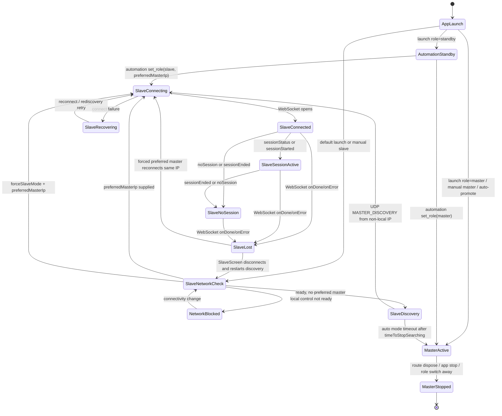
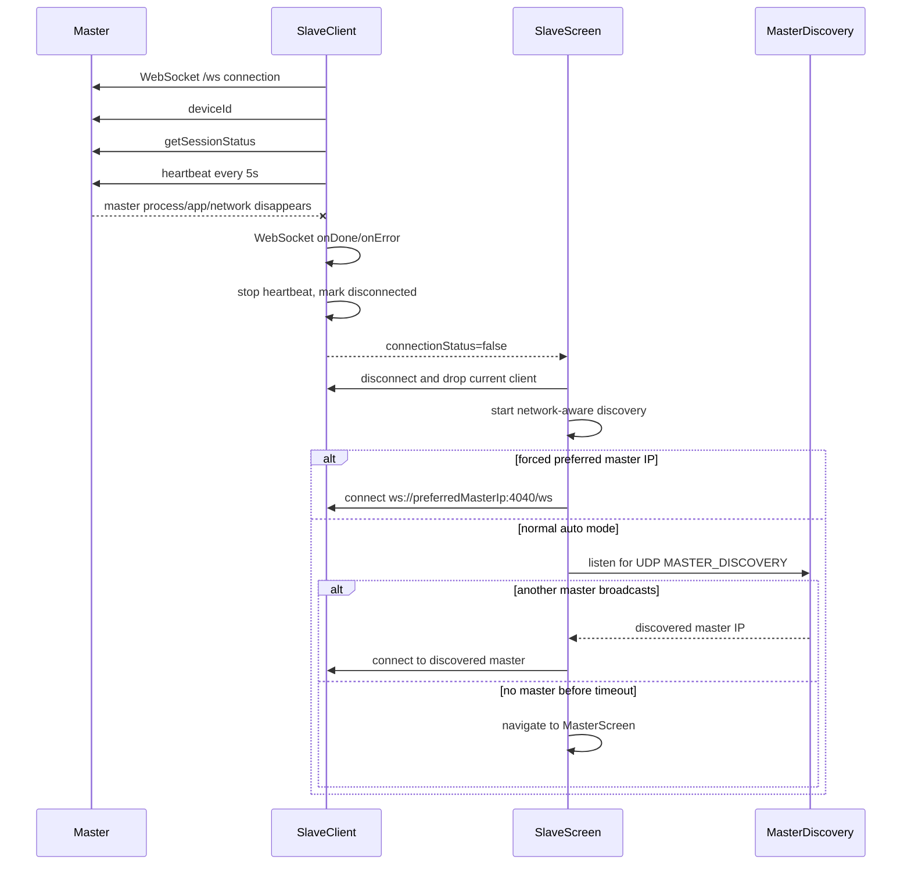
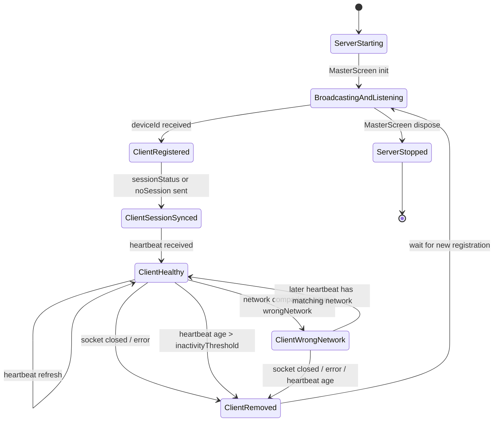

# HydraCam Device Relationship FSM

Derived on 2026-06-08 from the current Flutter app code and control-plane docs.
This document describes the current behavior first, then the recommended explicit
fleet FSM that should be implemented before treating master loss as production
safe.

## Current Documentation Coverage

The current docs describe the architecture, runtime role-switch evidence, and a
session reconnect backlog item, but they do not define a complete per-phone
finite-state machine for master loss.

Documented pieces:

- `AGENTS.md` and `docs/control/architecture-and-testing.md` state that the
  master advertises, slaves discover/connect, slaves send heartbeats, and slaves
  auto-reconnect.
- `docs/control/status-and-roadmap.md` records runtime role-switch proof, where
  an external runner explicitly promotes one device and points the other devices
  at the new master.
- `docs/control/backlog-import.md` has a high-priority reconnect/session
  integrity item, but it is about preserving session state after reconnect, not
  electing or recovering a missing master.

Important gap: there is no durable contract for what each phone must do when the
master disappears during discovery, active session, or active recording.

## Current Code-Derived FSM

Sources:

- `lib/main.dart`: startup role decision and automation role switching.
- `lib/slave/slave_screen.dart`: network readiness, discovery, auto-promotion,
  and connection-loss handling.
- `lib/slave/master_discovery.dart`: UDP discovery on port `4041`.
- `lib/slave/slave_client.dart`: WebSocket connect, session-status sync,
  heartbeat, and reconnect timer.
- `lib/master/master_screen.dart`: master screen lifecycle, announcer, and
  server startup/shutdown.
- `lib/master/master_announcer.dart`: UDP master broadcast every 2 seconds.
- `lib/master/master_server.dart`: WebSocket server on port `4040`, session
  messages, command dispatch, heartbeat pruning, and stale-socket protection.

Current behavior details:

- Normal app launch defaults to `SlaveScreen(isAutoMode: true)`. If no master is
  found and local control is ready, the phone promotes itself after
  `timeToStopSearching` seconds.
- Master discovery is passive UDP broadcast discovery. The first non-local
  `MASTER_DISCOVERY` datagram wins; discovery stops after that.
- The slave sends `deviceId`, asks for session status, then sends heartbeat
  messages every 5 seconds.
- The master removes clients whose last heartbeat is older than
  `inactivityThreshold` seconds. That only updates the master's view of slaves;
  it does not tell the fleet who should become the new master.
- `SlaveClient` contains a reconnect timer, but `SlaveScreen` also listens for a
  false connection status, disconnects the client, clears it, and restarts
  network-aware discovery. In practice, the screen-level rediscovery path is the
  meaningful recovery path.
- Forced automation slaves with a preferred master IP skip the normal network
  readiness gate and reconnect to that explicit IP. They do not self-elect.

## Master Disappears: Current Flow

Risk: if the original master disappears, multiple auto-mode slaves can
independently hit the same timeout and become masters. There is no election
term, lease, quorum, priority, or backend authority in the current user-facing
flow. Runtime automation avoids this only because the Python runner explicitly
chooses one promoted master and sends slave role changes with the chosen
`preferredMasterIp`.

## Master's View Of Slaves

The master has a reasonable client tracking FSM. It does not own fleet recovery
when the master itself dies, because a dead master cannot notify the clients and
no surviving device has an agreed authority contract.

## Recommended Explicit Per-Phone FSM

This is the production-safe model the app should converge on. It separates role,
session relationship, and recording safety.

```mermaid
stateDiagram-v2
    [*] --> Booting
    Booting --> LocalControlBlocked: permissions/network not ready
    LocalControlBlocked --> Discovering: readiness restored
    Booting --> Discovering: local control ready

    Discovering --> FollowerConnecting: authoritative master discovered
    Discovering --> Candidate: no master before discovery timeout

    Candidate --> LeaderStarting: election/lease won
    Candidate --> FollowerConnecting: election/lease lost or newer master seen

    LeaderStarting --> LeaderIdle: WebSocket server bound and announcer active
    LeaderIdle --> LeaderSessionActive: session created or restored
    LeaderSessionActive --> LeaderRecording: recording started
    LeaderRecording --> LeaderSessionActive: recording stopped and media saved
    LeaderSessionActive --> LeaderIdle: session ended cleanly

    FollowerConnecting --> FollowerIdle: connected, master has no active session
    FollowerConnecting --> FollowerSessionActive: connected, sessionStatus received
    FollowerIdle --> FollowerSessionActive: sessionStarted
    FollowerSessionActive --> FollowerRecording: startRecordingVideo
    FollowerRecording --> FollowerSessionActive: stopRecordingVideo and local save
    FollowerSessionActive --> FollowerIdle: sessionEnded/noSession reconciled

    FollowerIdle --> MasterMissingIdle: master heartbeat/socket lost
    FollowerSessionActive --> MasterMissingSession: master heartbeat/socket lost
    FollowerRecording --> MasterMissingRecording: master heartbeat/socket lost

    MasterMissingIdle --> Discovering: restart discovery immediately
    MasterMissingSession --> RejoinOrRecover: preserve active session and media
    MasterMissingRecording --> OrphanedRecordingPolicy: keep saving locally; apply configured stop/rejoin policy

    RejoinOrRecover --> FollowerSessionActive: same session master rejoined
    RejoinOrRecover --> Candidate: recovery timeout and election allowed
    RejoinOrRecover --> ManualIntervention: conflicting session/master identity

    OrphanedRecordingPolicy --> FollowerRecording: same session master rejoined
    OrphanedRecordingPolicy --> LocalRecordingSaved: local stop policy fires
    LocalRecordingSaved --> RejoinOrRecover: preserve media and await authority

    LeaderIdle --> SteppingDown: stronger authority/master lease observed
    LeaderSessionActive --> SteppingDown: stronger authority/master lease observed
    SteppingDown --> FollowerConnecting: connect to authoritative master
```

Required contract decisions before implementation:

- Authority: decide whether master election is backend-led, deterministic local
  priority, or manual-only. The current timeout auto-promotion can create
  split-brain masters.
- Session identity: every reconnect should compare session GUID, master device
  ID, and session generation/term before accepting `sessionStatus`.
- Master lease: slaves need a bounded "master missing" timer that is distinct
  from socket reconnect and distinct from "no master found at app startup".
- Recording policy: if a slave is recording when the master disappears, define
  whether it keeps recording until storage/battery stop, stops after a grace
  window, or waits for a new master. The current code has no master-loss-specific
  recording policy.
- Split-brain handling: if two masters are seen, phones need a deterministic
  rule for which authority wins and how the losing master steps down without
  losing active session/media.
- Observability: UI and automation should expose the relationship state, not
  just "connected clients" and free-form status text.

## Minimal Implementation Slices

1. Add a typed relationship state model and expose it in UI/automation:
   `localRole`, `masterDeviceId`, `masterIp`, `sessionGuid`, `connectionState`,
   `authorityTerm`, `recordingState`, and `lastMasterSeenAt`.
2. Replace free-form slave connection recovery with explicit
   `MasterMissingIdle`, `MasterMissingSession`, and `MasterMissingRecording`
   states.
3. Disable uncoordinated auto-promotion during active sessions/recording until an
   authority rule exists.
4. Add deterministic election or backend/manual authority for idle devices.
5. Add tests and device evidence for: startup discovery, master disappears while
   idle, master disappears during active session, master disappears while a slave
   is recording, duplicate masters appear, and reconnect to same session.
