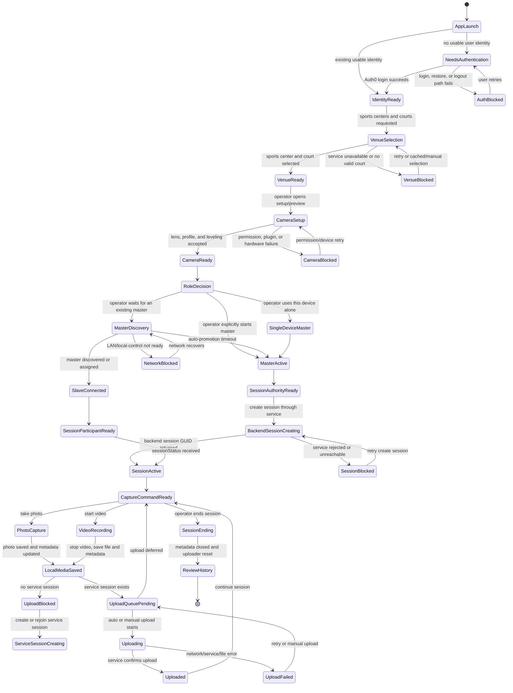
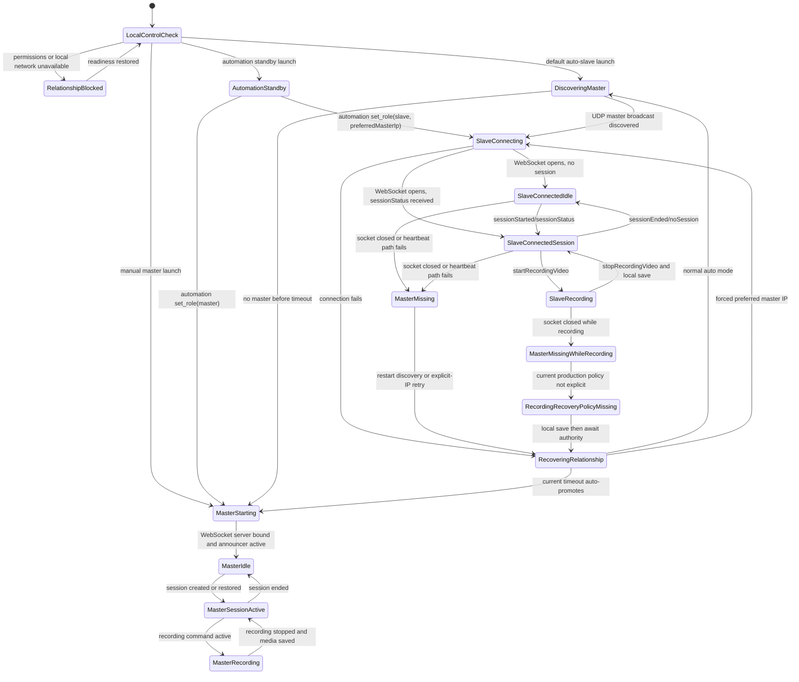
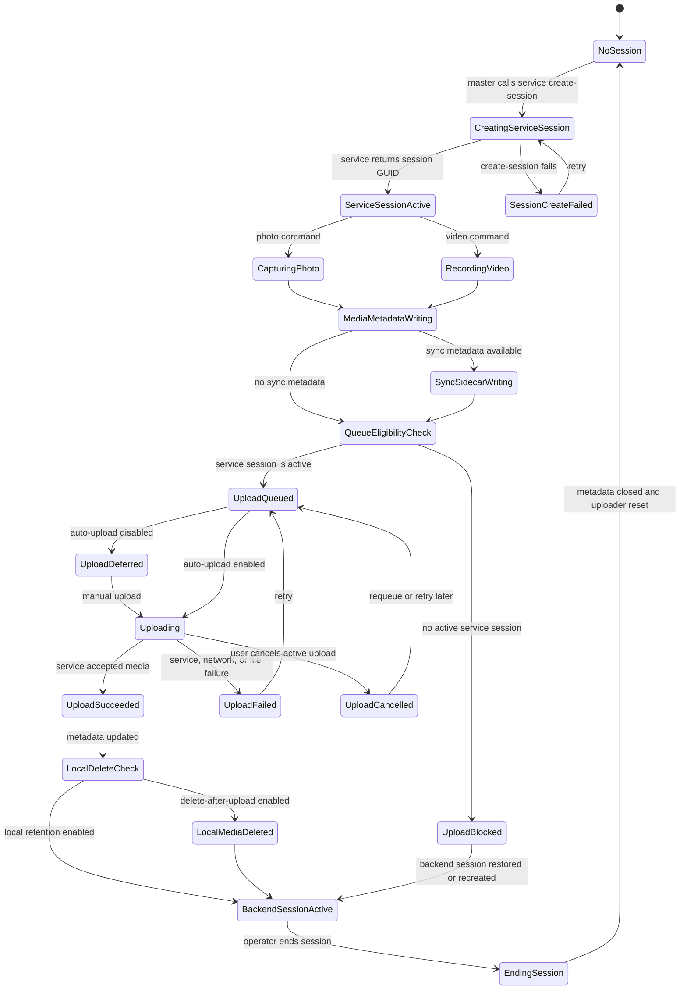
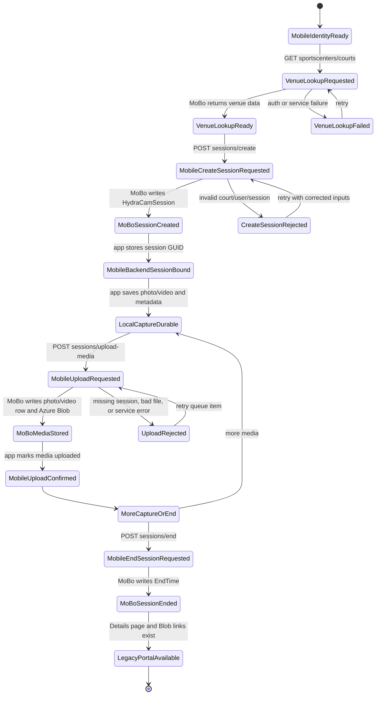
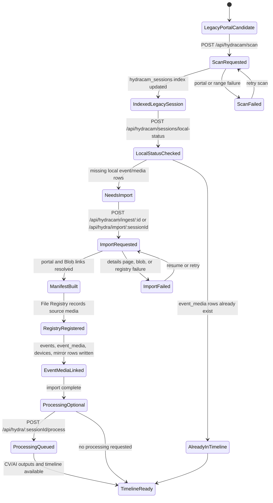
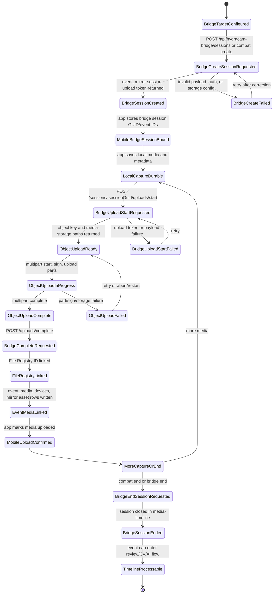
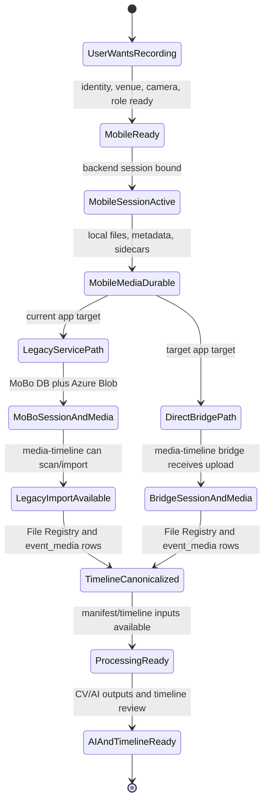

# HydraCam User Flow FSM Diagrams

Last reviewed: 2026-06-18 (content dated 2026-06-18).
Last derived: 2026-06-14.

This document turns the user-flow tracker into finite-state-machine diagrams.
It keeps two layers separate:

1. App-facing user journeys inside the HydraCam Flutter app.
2. Cross-system relationship states between HydraCam mobile, the legacy
   HydraCam/MoBo service, and media-timeline.

Source evidence checked for this pass:

- `docs/control/user-flow-tracker.md`
- `docs/control/device-relationship-fsm.md`
- `docs/control/hydracam-mobo-media-timeline-merge-plan.md`
- `docs/control/cross-project-api-data-map.md`
- `lib/services/hydracam_api_service.dart`
- `lib/services/session_manager.dart`
- `lib/services/uploader_service.dart`
- `/Users/jose/src/work/mobo/KEOB_Motherboard_2_Web/Controllers/HydraCam/HydraCamApiController.cs`
- `/Users/jose/src/work/media-timeline/backend/src/routes/hydraCamBridge.ts`
- `/Users/jose/src/work/media-timeline/backend/src/routes/hydracamRoutes.ts`
- `/Users/jose/src/work/media-timeline/backend/src/routes/hydra.ts`

## Diagram Legend

| Marker | Meaning |
| --- | --- |
| `current` | Implemented path in the current app/service code. |
| `partial` | Code or tests exist, but the user/device flow is not fully proven. |
| `future` | Product-valid target that needs backend/media-timeline cutover work. |
| `blocked` | Known credential, device, service, or policy blocker. |

## App User Journey FSM

This is the top-level mobile journey from launch to review. It deliberately
keeps local capture durability before upload success, because the app must not
lose media when the service is slow, unavailable, or mid-cutover.

Primary release gaps:

- `UF-04`: true attended two-device master/slave capture and upload evidence.
- `UF-07`: explicit production policy for reconnect and master loss.
- `UF-13`: cutover from legacy MoBo upload to media-timeline bridge.

## Role And Relationship FSM

The detailed current-code device relationship FSM lives in
`docs/control/device-relationship-fsm.md`. This reduced version shows how the
user journey depends on that relationship state.

Risk to keep visible: current timeout auto-promotion can create split-brain
masters if several idle slaves lose the same master. Runtime automation avoids
this by explicitly choosing the promoted master and assigning every slave.

## Session And Upload FSM

This diagram describes the local app state around `SessionManager`,
`UploaderService`, and the current `HydraCamApiService`.

Important current behavior:

- Upload is blocked if the session was not created or joined as a backend
  session.
- Local file and metadata writes happen before the upload queue is drained.
- The mobile app still targets `https://hydracam.azurewebsites.net/api`.

## Current Mobile To HydraCam Service FSM

This is the current production-shaped path: mobile uploads to the legacy
HydraCam/MoBo service. media-timeline only sees the result later through
legacy scan/import routes.

State ownership:

| State family | Owner today | Durable key |
| --- | --- | --- |
| Capture files and `metadata.json` | HydraCam mobile | `sessionGuid` plus media paths |
| Backend session row | MoBo HydraCam service | `HydraCamSession.Guid` |
| Uploaded blobs | Azure Blob through MoBo | `hydracam/<sessionGuid>/...` |
| User-visible legacy detail page | MoBo portal | numeric session ID |

## Current Media-Timeline Legacy Import FSM

This is the current relationship after legacy mobile uploads exist. It is a
read/import/process path, not the direct mobile upload path.

State ownership:

| State family | Owner today | Durable key |
| --- | --- | --- |
| Legacy session index | media-timeline | MoBo numeric session ID |
| File resolution | File Registry v2 | file ID plus source locator |
| Canonical review data | media-timeline | event ID and `event_media` rows |
| Processing/timeline outputs | media-timeline CV/AI services | event/session IDs |

## Target Direct Bridge FSM

This is the intended cutover path from the merge plan. It should replace new
mobile-to-MoBo uploads only after the bridge contract is proven end to end.

Cutover guardrail: do not move the mobile app to the bridge until media-timeline
tests prove one photo and one video create the expected event, File Registry,
`event_media`, device, and mirror rows.

## Cross-System State Relationship

This diagram shows how the same real-world capture moves across state owners.
The left-to-right progression is logical ownership, not necessarily a single
request chain.

Relationship rules:

- The mobile app owns capture reliability and local durability.
- The legacy HydraCam/MoBo service owns historical compatibility and current
  deployed API behavior.
- media-timeline owns new canonical event/media/timeline/AI state.
- `sessionGuid` is the stable cross-system key; numeric MoBo IDs are legacy
  provenance keys.
- Role-only multi-device proof is not upload proof, and upload proof is not
  media-timeline processing proof.

## Validation And Maintenance

Use this document with `docs/control/user-flow-tracker.md`:

1. Update the tracker status first when evidence changes.
2. Update these diagrams when a state or ownership boundary changes.
3. For docs-only edits, run `git diff --check`.
4. For mobile behavior changes, follow the validation tier in
   `docs/control/regular-evaluation-plan.md`.

## Next Implementation Decisions

1. Decide whether production master authority is manual, deterministic local
   election, or backend-led.
2. Prove `UF-04` with a true two-device master/slave capture and upload run.
3. Finish the media-timeline bridge acceptance test before changing the mobile
   API target.
4. Add bridge configurability to `HydraCamApiService` only after the target
   direct bridge FSM has a passing backend proof.
